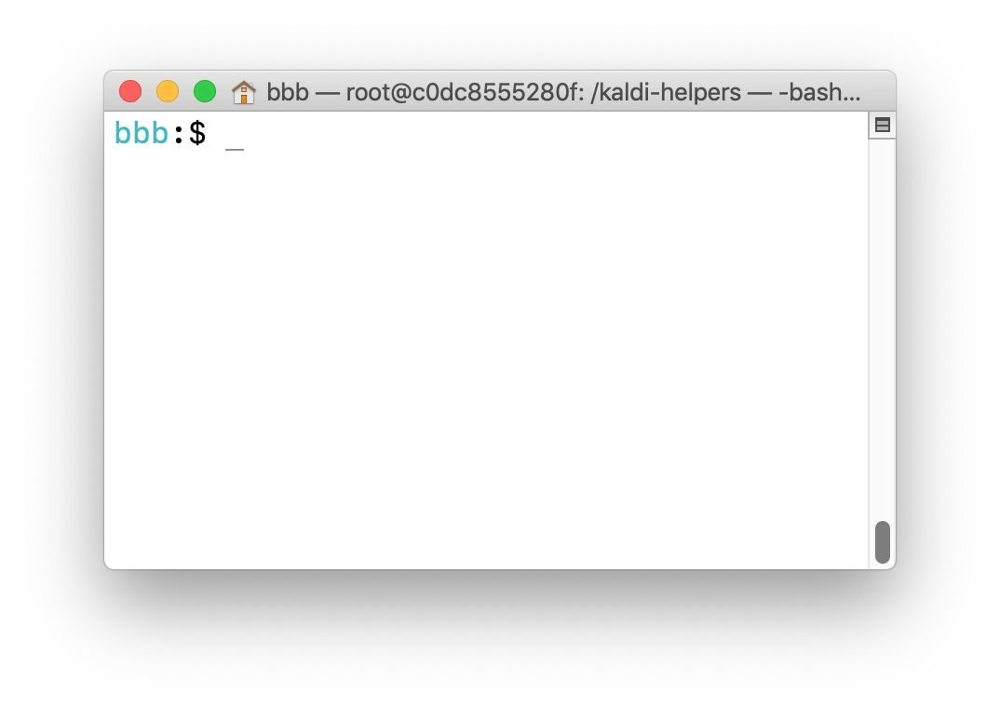

This workshop covers the steps required to install and use an automatic speech recognition system, to obtain a transcription for an untranscribed audio file. 

We will use *Elpis*, a collection of small tools which will help us to prepare our language data in the format required to use a speech recognition tool called *Kaldi*. Elpis is a wrapper, or interface, to Kaldi.

Please refer to the *Glossary* for more information about particular terms used in the workshop, and let us know if there are other terms which need to be explained. The link to the Glossary is in the Slack channel.

**EEEEK… What to do if you run into a problem?**
First, check the *Questions* document (refer to Slack for the link). As we find answers to common problems, we will add information to this doc. If your problem is not described, please add it and let us know. 

Prepare for the workshop by

- [Installing Docker](2018-summer-workshop-preparation#install-docker-on-your-computer)
- [Downloading the coedl/kaldi-helpers docker image](2018-summer-workshop-preparation#download-the-workshop-code)
- [Downloading a toy corpus](2018-summer-workshop-preparation#download-some-toy-data)


Contents of this document

- [The tools](#the-tools)
- [Exercise 1 Getting familiar with Docker](#exercise-1-getting-familiar-with-docker)
- [Exercise 2 Sharing data with a Docker container](#exercise-2-sharing-data-with-a-Docker-container)
- [Exercise 3 Loading data into a container with Elpis and Kaldi installed](#exercise-3-Loading-data-into-a-container-with-Elpis-and-Kaldi-installed)
- [Exercise 4 Running Kaldi with a toy corpus](#exercise-4-running-kaldi-with-a-toy-corpus)
- [Exercise 5 Using your own Elan data with the Kaldi container](#exercise-5-using-your-own-elan-data-with-the-kaldi-container)
- [Using data formats other than Elan](#using-data-formats-other-than-elan)
- [Further reading](#further-reading)


## The tools

**Docker** is a program which helps standardise the way we do computational tasks with data, regardless of the operating systems of all the people who might want to run those tasks. Rather than building separate code for Windows, Linux, Mac operating systems, we can write once and run it on a myriad of operating systems using Docker. For more information about Docker, view [Nay San's slides](http://goo.gl/qxQDPP).

Run the Docker installer. You may be prompted to authenticate the installer with your computer's password.

Once Docker is installed, start it. On a mac, you will see a little whale icon in the top menu bar. On Windows you'll see a whale icon in the system tray.

For the rest of the workshop, we will be using a **terminal** to interact with Docker and Elpis. 

 > A terminal is a program you need to use in order to control Docker. Docker itself will run on your computer and you communicate with it via simple, one-line text commands entered within your terminal application. When you use an application like Elan or Word, you are using a 'graphical user interface (GUI)' to do stuff to your data via menus and buttons. Another way of doing stuff with your data is by running software scripts that don't have a GUI, via a terminal, also known as a command line or command prompt.

On Mac, use the *Terminal* app in your *Applications > Utilities* folder. For Windows, type  `command` or `cmd` into the search field in your taskbar. Then, click or tap on the *Command Prompt* result.

Let's make sure that Docker has installed. Open your terminal, and type the following **command** at the **prompt**. 

```
$ docker --version
```



 > A command is an instruction that tells a program to do something. 

 > On mac, the prompt is `$` and Windows it is `>`. You'll see in this guide that the commands we write are prefixed by the prompt. You don't need to type the `$` or `>` when you use the commands, just type what follows. Also, press Return (or Enter) after typing the command.

In this command, `docker` is the name of the program we want to use, `—version` is an option (also known as an argument, flag or switch). When we work with command line programs, we don't have buttons or menus to interact with the program, so we use options to control what the program does. 

After running that command, we should see some version information. Hooray! Docker is set up OK. Now let's start working with Docker images.


## Exercise 1 Getting familiar with Docker
Let's get a taste of using Docker images and containers by playing with a very simple one first. In your terminal, type this command (remember, you don't include the prompt):

```
$ docker run hello-world
```

All going well, you should get some words in your terminal like this.

    Hello from Docker!
    This message shows that your installation appears to be working correctly.

    To generate this message, Docker took the following steps:
     1. The Docker client contacted the Docker daemon.
     2. The Docker daemon pulled the "hello-world" image from the Docker Hub. (amd64)
     3. The Docker daemon created a new container from that image which runs the executable that produces the output you are currently reading.
     4. The Docker daemon streamed that output to the Docker client, which sent it to your terminal.

What does that mean?

The first time you run this command, Docker will look for a local, previously downloaded version of the “hello-world” image. You should see a message that Docker was “Unable to find image 'hello-world:latest' locally”. It will then attempt to download the image from the Docker Hub.

If you see "*Hello from Docker! This message shows that your installation appears to be working correctly*." it is a sign that all is working well. Let's unpack the messages of what has happened.

1. *The Docker client contacted the Docker daemon*.

The client is the program that you ran when you typed 'docker' at the prompt. The daemon is the software that runs in the background, accessible by the whale icon in the top menubar on mac, or by the whale icon in the Windows system tray.

2. *The Docker daemon pulled the "hello-world" image from the Docker Hub*.

This means that an image was downloaded from the Docker cloud server to your computer. You can check which images you have by typing `docker images` at the command prompt, and it will show a list in the terminal of the images that are available.

3. *The Docker daemon created a new container from that image which runs the executable that produces the output you are currently reading*.

Docker unpacked the image and made a container. Then it ran a little program that output some words.

4. *The Docker daemon streamed that output to the Docker client, which sent it to your terminal*.

This means that the words ended up showing in your terminal.

Well, that’s all this exercise does. Once it has output the information to the screen, Docker will exit, closing the container.


## Exercise 2 Sharing data with a Docker container

To work with our own data in the container, we share a folder containing our data with the container. 

Open a terminal window and change into the Abui data directory on your desktop. If it's not there, follow the steps in the [Download some toy data](2018-summer-workshop-preparation#download-some-toy-data) section.

Mac
```
$ cd ~/Desktop/abui-toy-corpus
```

Windows (replace username with your username)
```
$ cd C:\Users\username\Desktop\abui-toy-corpus
```

The next command extends what we have used so far, adding a new option `-v` with a value, being the path to the local data joined to a name by which we will be able to access the folder inside the container.

```
$ docker run -it -v `pwd`:/docs-inside-docker alpine
```

What's it all mean?

`docker run` loads an image in Docker.

`-it` is an *option*, which tells Docker to allow us to interact with the container that is created.

`-v` tells docker that we want to share a volume.

`pwd:/docs-inside-docker` are parameters for the `v` option. The information before the colon is the path to your local data (also known as the source). The information after the colon is where it ends up in the container (also known as the target).
You can give a full path to your data, or use the `pwd` shortcut to your *present working directory* (your current folder).

`alpine` is the name of the image we are running.


You may need to copy and paste the command as the backtick things around `pwd` may not be on your particular keyboard! They aren't on the German keyboard for instance. Remember that you don't need to copy the `$`, just what follows it.

After you type (or paste) that command into terminal, and press return, we can verify that the local data has been shared with the container with this command.

```
/ # ls docs-inside-docker/
```

This will list the files in the container's *docs-inside-docker* folder. They should be the names of the files that you see in your Finder or Windows Explorer view of the input folder. Type `exit` at the command prompt to close the container.

```
/ # exit
```


## Exercise 3 Loading data into a container with Elpis and Kaldi installed

In this exercise, we will load some example data into a container that has Elpis and Kaldi installed.

Refer to the workshop preparation guide for how to [download the image](2018-summer-workshop-preparation#download-the-workshop-code). 


Wait while it downloads, then we can run a container from it. The following command will load the present working directory into the container. We also introduce a new option `--rm` which cleans up when we exit the container.

Mac
```
$ docker run -it --rm -v ~/Desktop/abui_toy_corpus/:/kaldi-helpers/input coedl/kaldi-helpers:0.XXXX
```


Windows (all on one line, and change your username and path to the corpus to suit)
```
> docker run -it --rm -v C:\Users\Billy\Desktop\abui_toy_corpus/:/kaldi-helpers/input coedl/kaldi-helpers:0.XXXX
```

Pulling apart what it means:

```
$ docker run -it --rm -v ~/Desktop/abui_toy_corpus/:/kaldi-helpers/input coedl/kaldi-helpers:0.2
```

- `$` this is the prompt, after which we type our commands. Will be `>` on Windows
- `docker run` this runs a docker image
- `-it` interactive mode (so that you can stay inside while working. Otherwise it will immediately EXIT the docker container after running this command)
- `--rm` clean up/fully close the container after it's done (when you exit it)
- `-v`  mount (kind of like sharing) a volume (essentially a folder or directory)
- `~/Desktop/abui_toy_corpus/` the source (location) of the folder on your computer that you want to use inside the container. This is the folder that has our config, data and output folders in it.
- `:` …will be shared into…
- `/kaldi-helpers/input` the target location, where we want the source folder to be within the docker container.
- `coedl/kaldi-helpers:0.XXXX` the name and version number of the docker image that you want to build a container from


## Exercise 4 Running Kaldi with a toy corpus

4.1 Now we have the data shared with a Kaldi image that has our pipeline tasks, we can build and run the ASR system.

    / # task _run-elan

4.2 When this task has completed, you should see a 'Done' message. At this point, Kaldi has been set up with files in the right places for it to begin learning. Run the train-test task.

    / # task _train-test

4.3 When this has completed, you will see a list of WER and SER values.

4.4 Interpret the results!

4.5 Now, try inference

4.6 Exit the container to close it.

    / # exit


## Exercise 5 Using your own Elan data with the Kaldi container

5.1 Prepare your data. [Read more about that here](cleaning-data).

5.2 Set up your folders
    - On the Desktop, create a new folder, name it **elpis_workshop**.
    - Note: In Windows Home, if you're using Docker Toolbox version, you need to do this is Users/[Username]/
    - Inside it create two new folders, call one **input**, the other **output**. 
    - Inside *input*, make two folders: a **config** folder, and a **data** folder. 
    - Leave the **output** folder empty. 

    ├── elpis_workshop
    │   ├── input
    │   │   ├── config
    │   │   └── data
    │   └── output

5.3 Add the config files
    - Copy the *optional_silence.txt* and *silence_phones.txt* files from the Abui toy corpus config folder into your *config* folder.
    - In your *config* folder we need to create a text file which has a letter to sound map...

5.4 Add your data
    - Put your audio and transcription files inside the *data* folder.

5.5 Now we will share the project directory with a new Docker container.

    $ docker run -it --rm -v ~/Desktop/elpis_workshop/:/kaldi-helpers/input coedl/kaldi-helpers:0.XXXX

5.6 Now you can run the tasks...
- If your data is in Elan format, and clean, use the default tasks. These tasks will build the project, train and test on your own data, using transcriptions from tiers named 'Phrase'.

```
/ # task _run-elan
/ # task _train-test
```

5.7 Once the models have been trained, you can get a hypothesis for untranscribed audio.
- Make a new folder in input called **infer**
- Put your sentence audio in there (for the demo, use a short sentence - 10 or 20 seconds)


## Using data formats other than Elan
To work with Praat Textgrid files, Transcriber trs files, or if you need to resample your data, use one of the [recipes](recipes) according to the particular type and condition of your data.

For information about the pipeline data processing options, run the `task` command inside the Docker image to show a list of helper tasks available, or read more about the [tasks here](tasks).

<!--
task: Available tasks for this project:
* _build:           Run through only the build stage with default settings (i.e. not the clean/filter/extract stage)
* _infer:           Run Kaldi inference_scripts on test data
* _infer-align:         Run Kaldi inference_scripts on test data and output_scripts ctm aligned files
* _rebuild-no-wav:      Run through only the build stage with default settings (i.e. not the clean/filter/extract stage)
* _run-elan:            Run through processing pipeline for Elan transcriptions
* _run-elan-split:      Segment audio and text by Elan annotation start/end times then run through processing pipeline with default settings
* _run-textgrid:        Run through processing pipeline for TRS transcriptions
* _run-trs:             Run through processing pipeline for TRS transcriptions
* _show-lattice:        Create pdf of the lattice graph
* _train-test:          Run Kaldi train and test stages on default settings
* cat-all-json:         Concatenate all .json files into one .json file
* clean-json:           Clean corpus of problematic characters before passing data to Kaldi
* clean-output-folder:      Delete all files and folders inside output_scripts directory
* copy-generated-files:     Copy generated files to appropriate (sub)directories under /output_scripts/kaldi
* copy-helper-scripts:      Copy the necessary scripts from Kaldi
* copy-phones-configs:      Copy provided silence/optional silence configuration files
* elan-to-json:         Convert a folder of .eaf files to a single JSON file
* extract-wavs:         Extract all wav files into kaldi folder
* gather-wavs:          Gather all wav files inside input_scripts/data into output_scripts/media.zip
* generate-kaldi-configs:   Generate config files for Kaldi from KALDI_TEMPLATES, populate with Taskvars
* generate-kaldi-files:     Generate corpus-related files for Kaldi from JSON data
* infer-full:           Prepare and run a test inference (so I don't have to)
* json-to-kaldi:        Generate files for the Kaldi format
* make-kaldi-subfolders:    Makes subfolder structure which Kaldi expects
* make-nonsil-phones:       Generate non-silence phones file from LETTER_TO_SOUND_PATH file defined in Taskfile.yml
* make-prn-dict:        Make pronunciation dictionary
* make-wordlist:        Make a list of unique words that occur in the corpus
* ready-example:        Prepares the Abui toy corpus for use with Kaldi/kaldi-helpers
* resample-audio:       Change audio to 16 bit 44.1kHz mono WAV
* silence-audio:        Silence audio that has an annotion in matching Elan file 'Silence' tier
* split-eafs:           Read Elan files, slices matching WAVs by start and end times of annotations on a particular tier, outputting separate clips and text. Skips annotations with value '*PUB' on the main tier, or annotations that have a ref annotation on the 'Silence' tier.
* textgrid-to-json:         Convert a folder of .textgrid files to a single JSON file
* tmp-delete:           Delete all files in tmp directory
* tmp-makedir:          Make the tmp directory, if it does not exist
* trs-to-json:          Convert a folder of .trs files to a single JSON file
-->


## Further reading

### Want to learn more about Kaldi?

From the official docs, this is a good place to start.

- [Kaldi for dummies tutorial](http://kaldi-asr.org/doc/kaldi_for_dummies.html)

These sites have good intros to Kaldi. Well explained, with guides and tutorials for getting started. Worth digging through, and Josh's installation guide is good to have while installing (if you aren't using the Docker image).

- [Eleanor Chodroff](https://eleanorchodroff.com/tutorial/kaldi/index.html)
- [Josh Meyer](http://jrmeyer.github.io/asr/2016/01/26/Installing-Kaldi.html)
- [Lyndon White](http://white.ucc.asn.au/Kaldi-Notes/resources)
- [A good Kaldi tutorial](https://groups.google.com/forum/#!topic/kaldi-help/tzyCwt7zgMQ)

Looking for particular features? 

- [Check the forums](https://groups.google.com/forum/#!forum/kaldi-help)
- [More info about Kaldi lattices](https://senarvi.github.io/kaldi-lattices/)
- [Kaldi lectures by Dan Povey](https://danielpovey.com/kaldi-lectures.html)

### Data

- [Unicode article](https://medium.com/@apiltamang/unicode-utf-8-and-ascii-encodings-made-easy-5bfbe3a1c45a)
- [Information about data standards, text encoding etc](https://www.sil.org/language-technology/standards)
- [voxforge open source data](https://www.voxforge.org)
- [openslr open source data](https://www.openslr.org)

### ASR tools

- [CMU Sphinx](https://cmusphinx.github.io/wiki/tutorial/)
- [Persephone](https://persephone-asr.org)

### Books

- *Natural Language Annotation for Machine Learning* by James Pustejovsky and Amber Stubbs  
- *Natural Language Processing with Python* by Steven Bird, Ewan Klein and Edward Loper  
- *Speech and Language Processing* by Daniel Jurafsky and James Martin  
- *Foundations of Statistical Natural Language Processing* by Christopher Manning and Hinrich Schuetze  
- *Text-to-Speech Synthesis* by Paul Taylor  
- *The HTK Book* by Steve Young etal  


