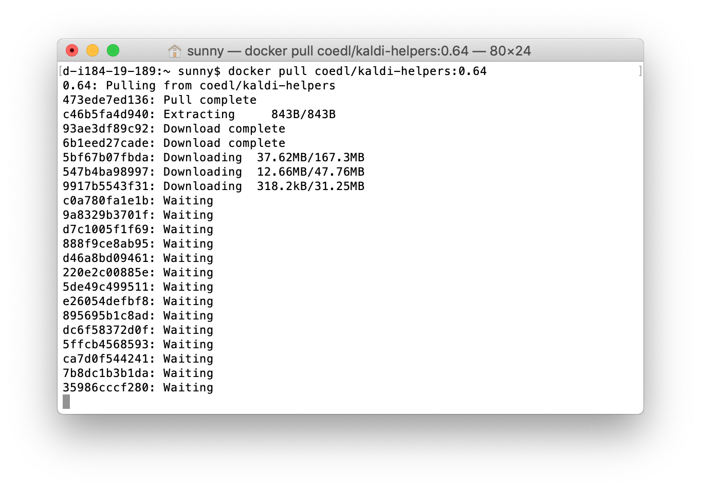

## Install Docker on your computer

Docker is the environment in which we will run Kaldi, one of the speech recognition systems. To install Docker, see the guides below for your system. It should install easily, please get in touch if you have issues with the installation.

* OS X: https://docs.docker.com/docker-for-mac/install/
* Linux (Ubuntu): https://docs.docker.com/engine/installation/linux/ubuntu/
* Windows: https://docs.docker.com/docker-for-windows/install/

> Note that the Windows version of Docker is designed for 64bit Windows 10 Pro. For older or non-pro (home) versions of Windows, try installing Docker Toolbox: https://docs.docker.com/toolbox/toolbox_install_windows/

> You may need to create an account with Docker in order to log in and download the application.


## Download the workshop code

After you have installed Docker, let's get the code that we'll use in the workshop. We'll go through what these instructions mean in the workshop step, but it would be good to do this before you get to Canberra as it can take a while to download. The image we are downloading is about 1GB in size.

1) Start the Docker application you have just installed.


2) Open up a *Terminal* or *Command Prompt* window.

> What is a terminal or command prompt??

> Programs like Word and Elan have a "graphical user interface (GUI)". This is a way of interacting with the program using menus, buttons, clicking on things with a mouse. Some programs don't have GUIs, you interact with them by typing instructions into the command line, or terminal.

> When you start your terminal, it will display a `$` or `>` sign at the start of the command line. Hence, when you see something like `$ blah blah blah` in the workshop steps, you don’t need to type the `$` sign, just type the words in the instruction that follow it.


3) In the terminal window, type the following just to check that docker is happy, and press *Enter* or *Return*.

```
docker --version
```

3.1) The result should be something like...
```
Docker version 18.06.1-ce, build e68fc7a
```


4) Now download the workshop code by typing or copy-and-pasting this into your terminal, and press *Enter* or *Return*.

```
docker pull coedl/kaldi-helpers:0.64
```

This might take a while, it should give you some information about progress. Please get in touch on the Slack channel if you get stuck. 



When it has downloaded, the terminal will show `Status: Downloaded newer image for coedl/kaldi-helpers:0.64`. Now you can close the terminal application.

