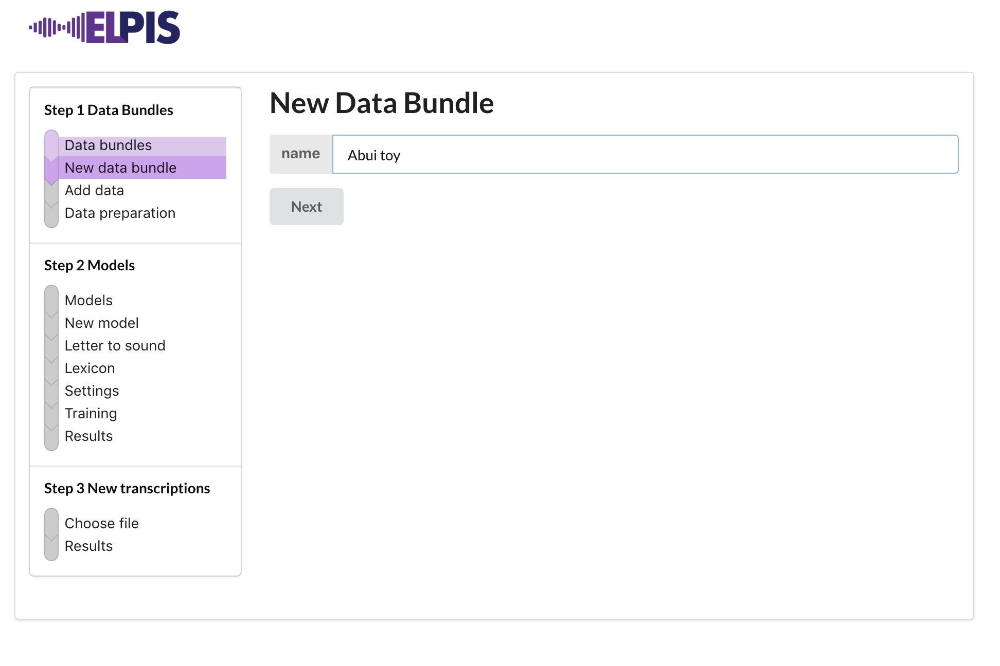
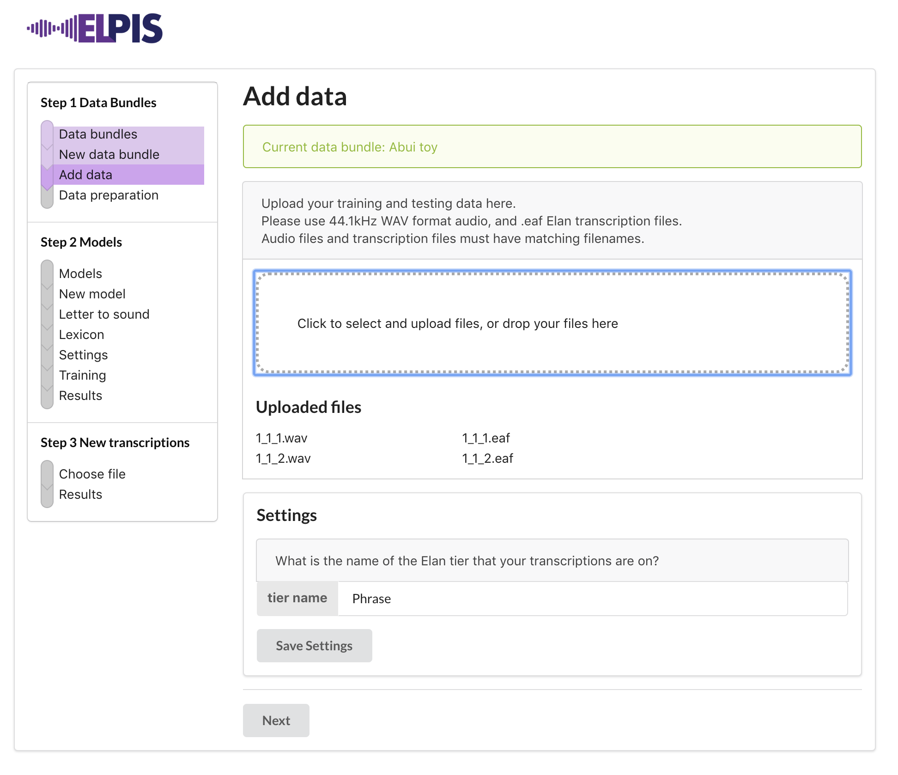
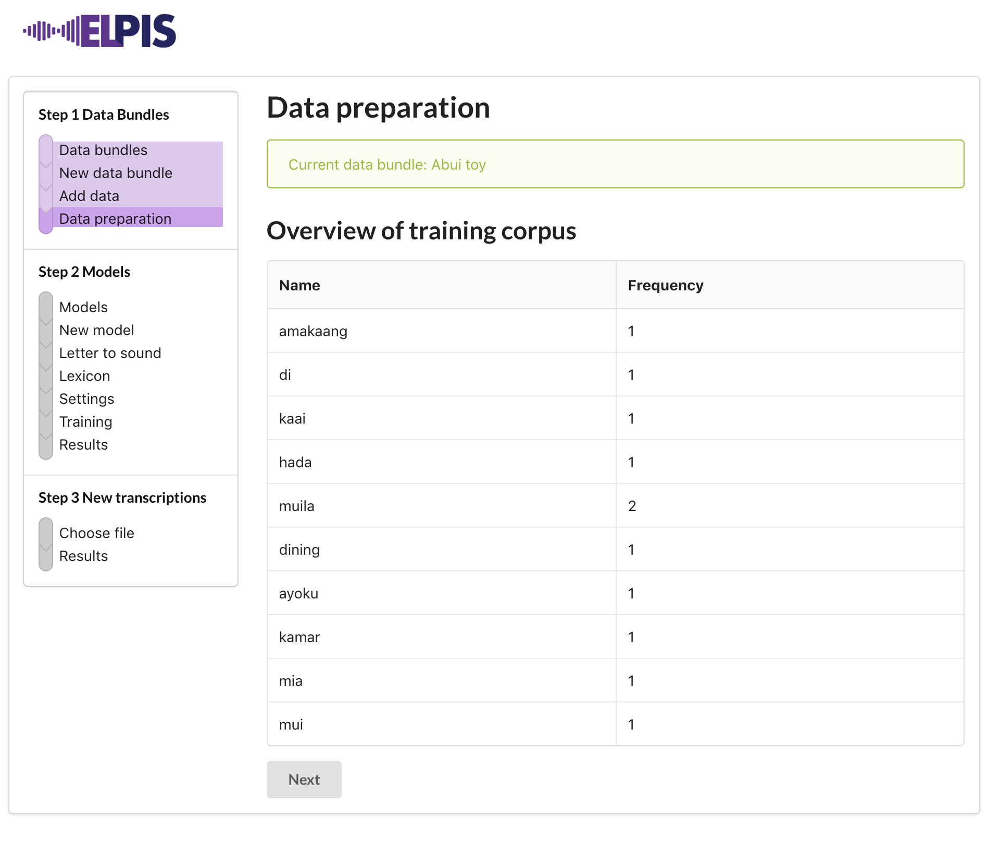
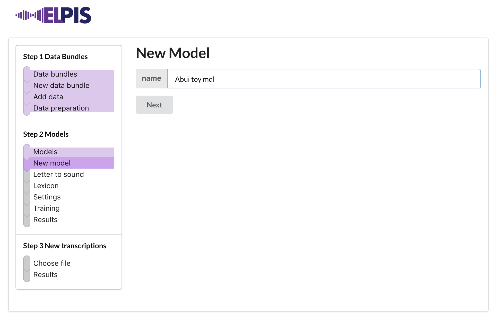
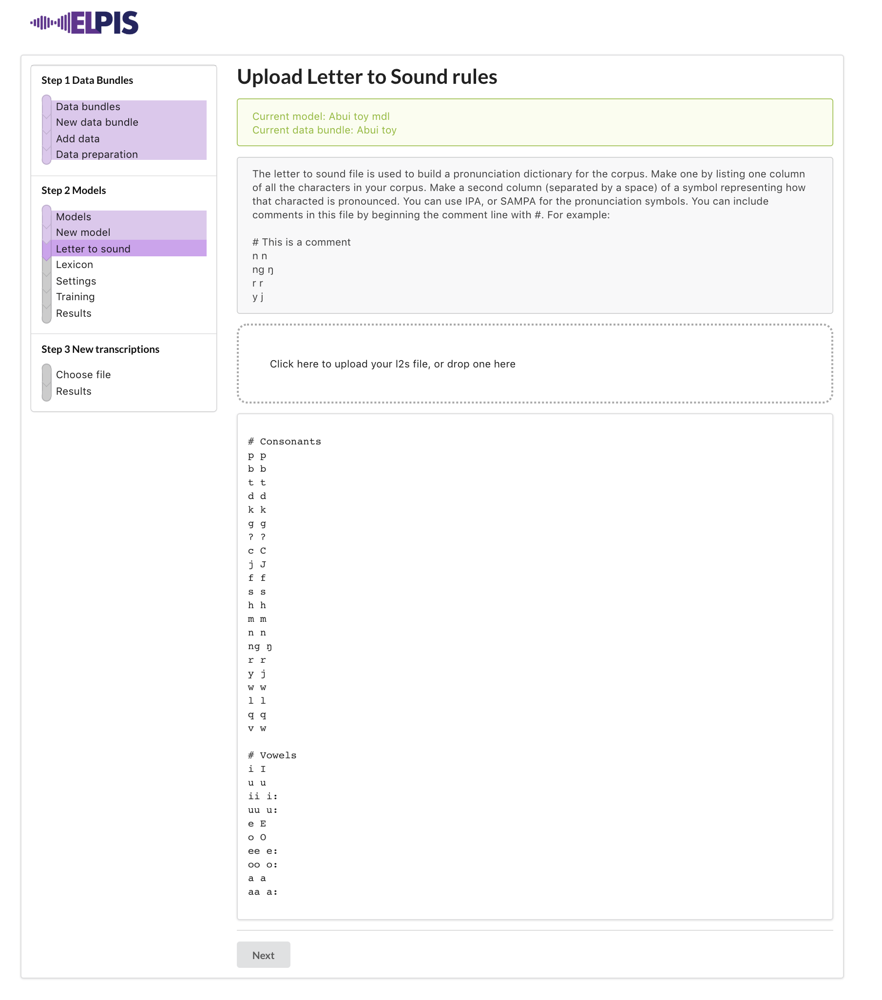
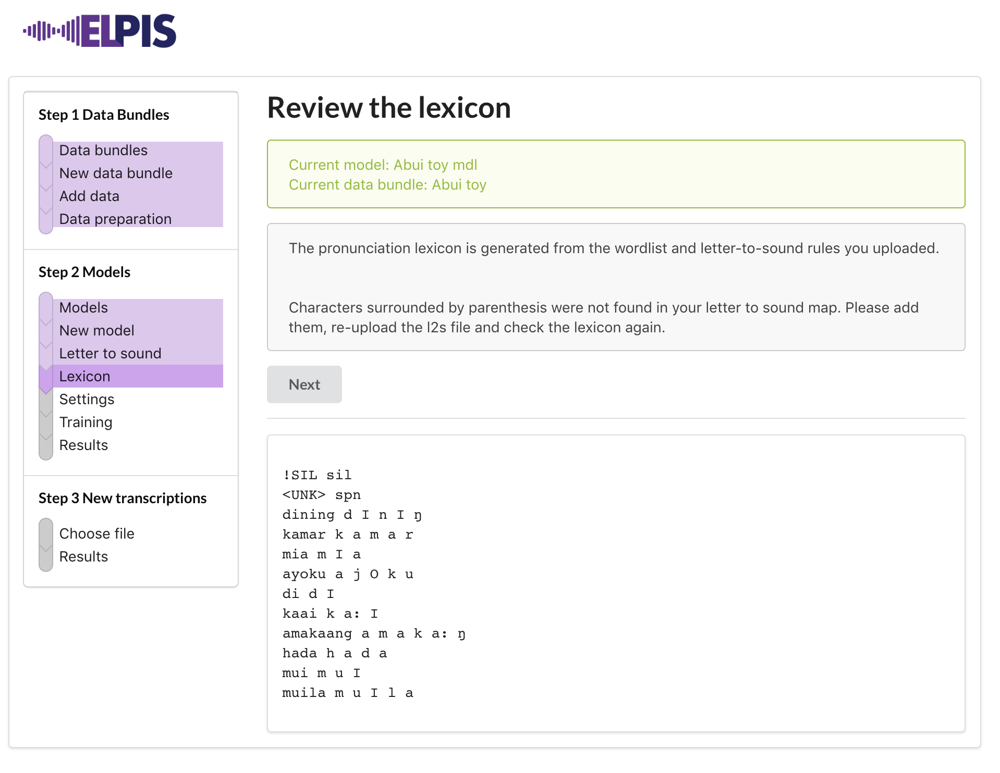
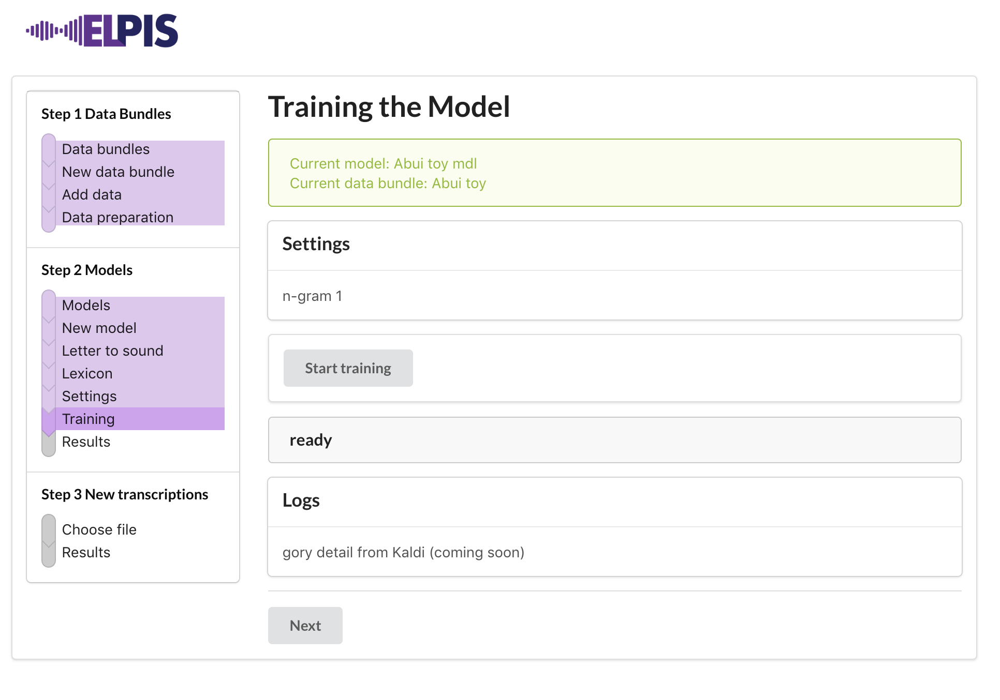
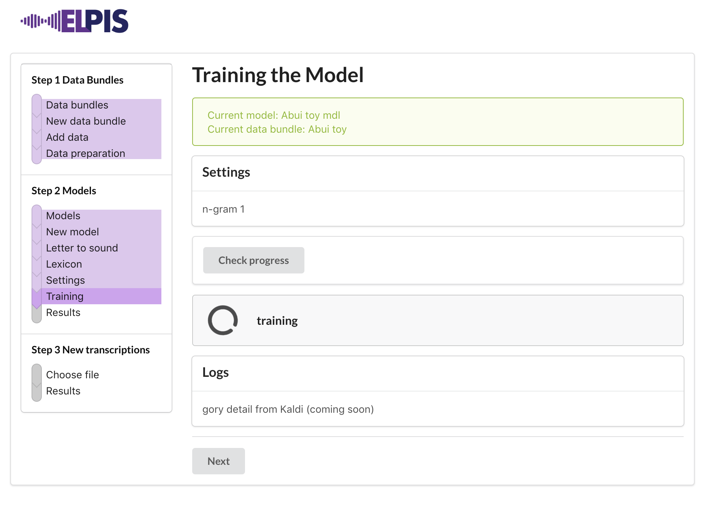

Workshop steps

## Overview 
The speech recognition process broadly involves steps of:

**Organising data** that will be used to train the system (training input)

**Cleaning data** (normalisation)

Making **pronunciation rules**

**Training** acoustic, pronunciation and language models

Then, using these models to get a **new transcription** on un-transcribed data. 

This is “machine learning” technology, not “artificial intelligence”. The system doesn’t ever “understand” or know your content in the sense of understanding the meaning what you give it.

If you run the Docker version of Elpis, the processing all happens on your local computer, no data is uploaded to cloud servers. It is safe to use where your ethics or permissions prevent sharing or uploading your data. 

---

## Setup


If you don't have Docker, or that means nothing to you, we have set up some temporary servers online. *Note that using one of these will send the language data to a server.* To use one of these machines, [open this Google spreadsheet], find a row that doesn't have someone's name in it yet, and claim a machine by putting your name in there. Copy the IP Address, open a new web browser (Chrome or Firefox), paste the address into the location bar and press Enter/Return to start Elpis. 

If you do have Docker installed, download and run the Elpis image by running this command in a terminal, when it is running open `http://0.0.0.0:5000` in a browser.
```
docker run --rm -p 5000:5000/tcp coedl/elpis:icldc
```


## Interface tour
Click through to the *Create New Bundle* page.



There are three main steps, with sub-steps in each. 

1. Data Bundles
2. Models
3. New transcriptions

**Data bundles** is where we collect and clean the audio and text which we will train the models with. 

**Models** is where “letter to sound” rules are applied to the data files to build a pronunciation dictionary, and then the acoustic and language models are trained. 

**New transcriptions** is the place we go to use an existing model to obtain a first-pass transcription on new audio. 

---

## About the files you need

The system trains with existing audio files and transcription files (also called data). Generally, the more data you can train with, the better the results. However, it’s not simply a matter of throwing everything you have into a bucket. Time spent cleaning and fine-tuning your existing transcriptions will have a good impact on your results. 

You will typically get better results with small data sets by using data from a common recording activity (also known as a domain), e.g. short sentences, or stories, or word-repetition exercises. 

For Elpis, the file format requirements are:

a) WAV audio, preferably 44.1kHz mono but the system can convert stereo files and resample from different sample rates.

b) Orthographic transcription of the audio. For today’s workshop, the interface is limited to using Elan transcriptions. 

> We have other tools that will convert TextGrid and Transcriber data and will integrate this in the near future. Please let us know about your own data formats so we can include them in future versions!

c) Filenames of the transcription must match the audio filename.

> We are working on different ways to deal with this but for now, these are best done manually.

Transcriptions don’t need to be word level. Annotations at an utterance/phrase level are fine. 

Clean your transcriptions by looking through them and checking the following:

- Standardise variation in spelling
* Replace non-lexical number forms, shorthand forms and abbreviations with full lexical forms. For example, replace ‘9’ with ‘nine’.
- For more cleaning tips, see the [Data preparation](https://github.com/CoEDL/elpis/wiki/Data-preparation) wiki page.

**When you are happy with your data,  make a New Data Bundle and then Add data.**



Check how the text has been cleaned on the **Data preparation** page. 



---

## Letter to sound preparation

The **letter to sound** file is a text file you create, of rules mapping your orthography into phonemic transcription. It will be used to build a pronunciation lexicon for your data set.

It is formatted in two columns, space separated. Left column is all the characters in your corpus. The right column is a symbol representing the sound. You can use IPA or SAMPA for the right column. Comments can be written in the file with a # starting the comment line. For example,

```
# Abui
j J
f f
s s
h h
m m
n n
ng ŋ
r r
```

**After preparing your letter-to-sound file, make a New Model**



**Then upload the Letter to sound file.**



This will build a pronunciation lexicon (also known as a pronunciation dictionary). Look at it on the **Lexicon** step.



Check words that have been transcribed with consecutive matching characters. Do they represent one sound or two? If only one, add a line to your  `letter-to-sound.txt` file, mapping the consecutive characters to a single symbol and rebuild the lexicon. 

For example, if `wu̱nne̱` is mapped to `wu̱nne̱ w ɨ n n ɛ` in the lexicon, then add `nn n` to `letter-to-sound.txt`, upload it again and rebuild the lexicon.  The results should be collapsed lexicon entry `wu̱nne̱ w ɨ n ɛ`.

If your language has diphthongs, put these earlier in the l2s, above single characters. For example,
```
ng ŋ
n n
```

---

## Training

Now your training data has been uploaded and the lexicon has been built, you are ready to start the training process. 

On the **Settings** step you can set the n-gram value. A 1-gram (unigram) value will train the model on each word. A 3-gram (trigram) value with train the model by words with their neighbours. 


Got to the **Training** step to kick off the training process. Press Start training to begin. At the moment we don’t have any indication of how the training is progressing.. we are planning on showing this in two ways - one friendly way of the sub-steps in the training being highlighted as it happens, and also showing the output from the Kaldi engine. 





When training is done, go to the Results page to see the stats for this model. 

---

## Results

The **Results** step shows values which we can learn to read to understand what happened in the training process. These numbers are scored by comparing the words in one of the original transcriptions against the machine's version.


The results are:

> WER - Word Error Rate
> a word count
> INS - words that have been inserted (added)
> DEL - words that were deleted (missed)
> SUB - words that have been substituted (mistaken)

----

## Making a new transcription

Now the model has been trained, on the **New Transcriptions** step we can **Choose a file**.


The transcribing begins when you upload it.  The process can take time, depending on how long your audio is. 

> Short audio only for now!

Go top the Results page. When transcribing is complete and the Elan file has been generated, the button to Download an Elan file will show. Save this into the folder that you got your new audio from.


> If you are using your own audio, rename the audio to `audio.wav`.


Listen in Elan. 


