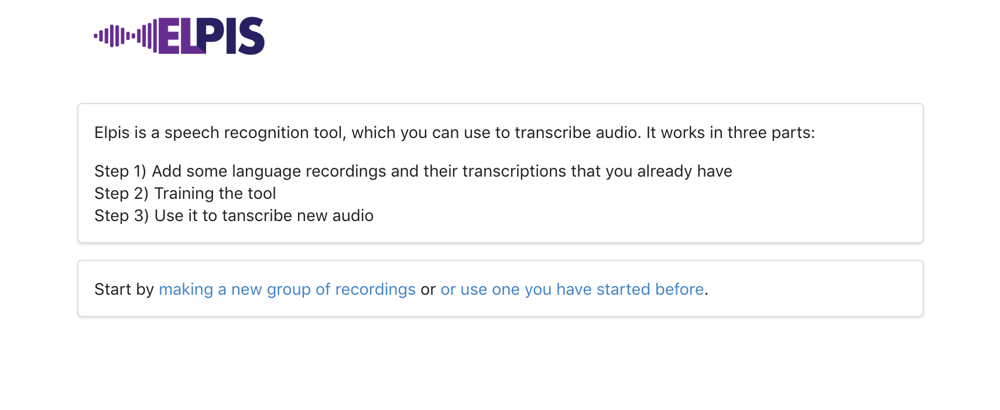
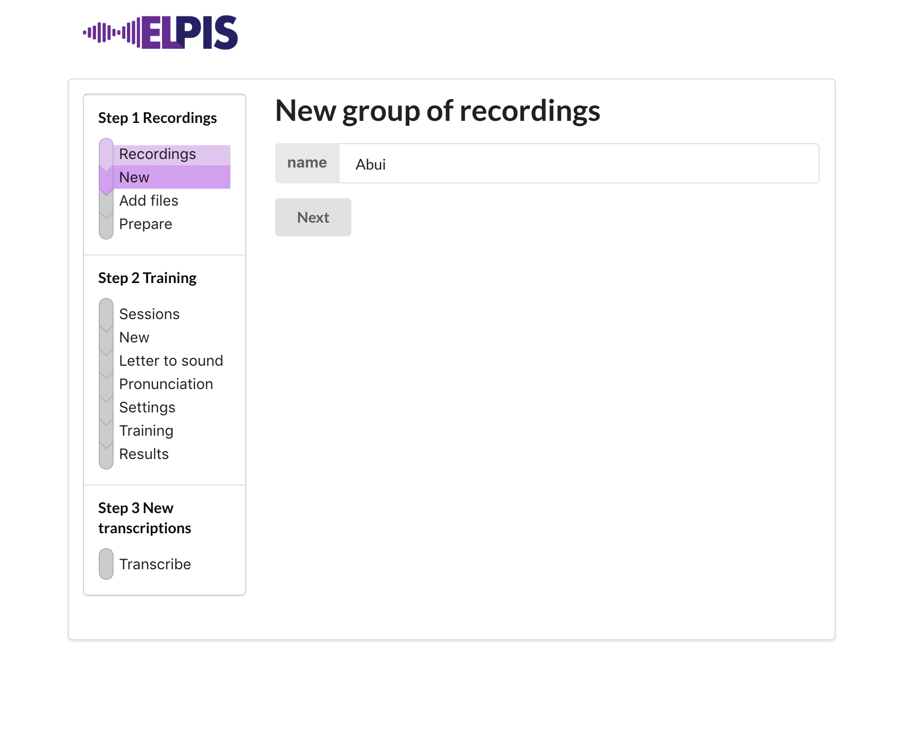
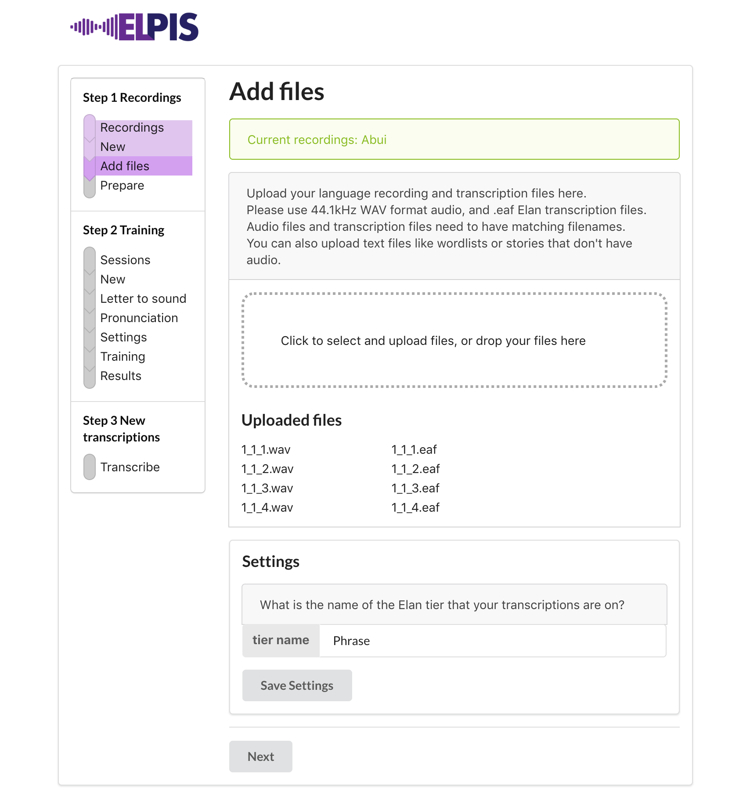
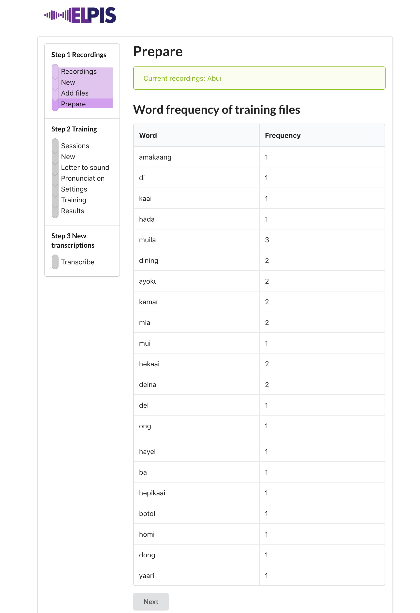
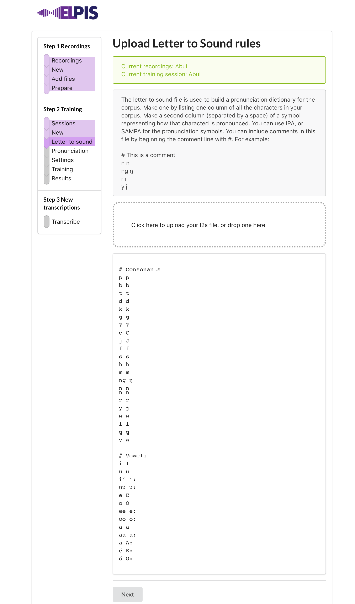
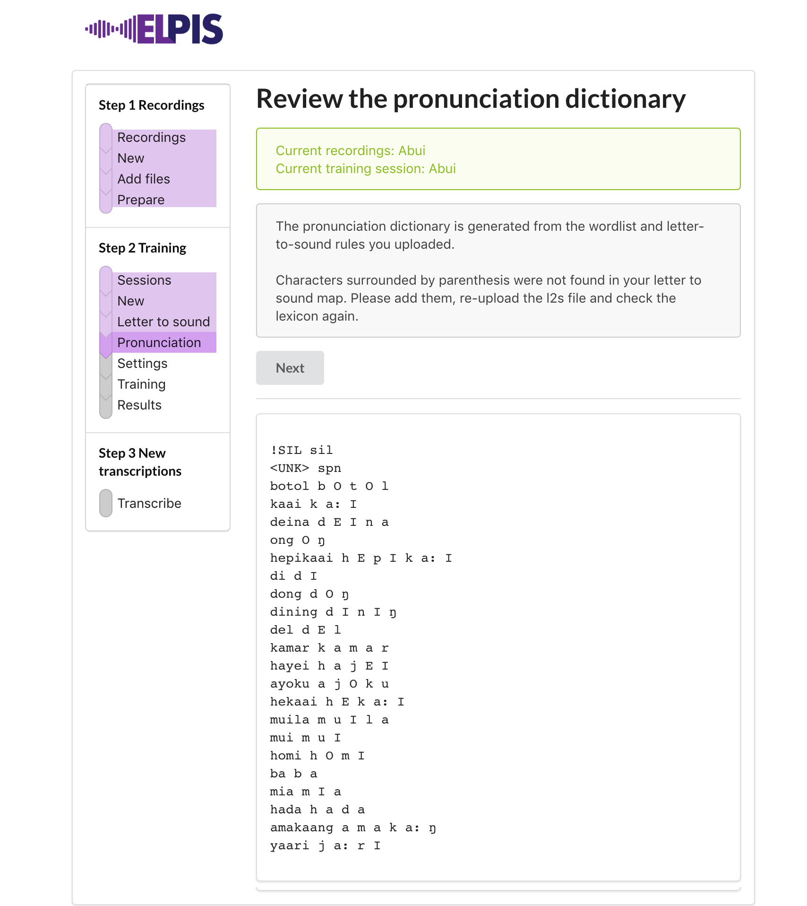
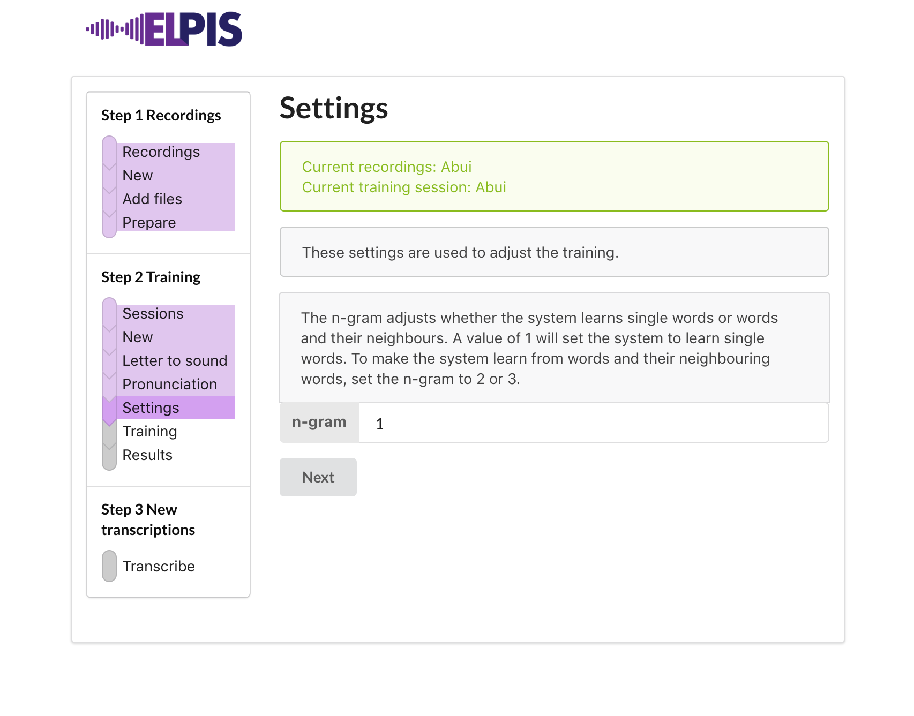
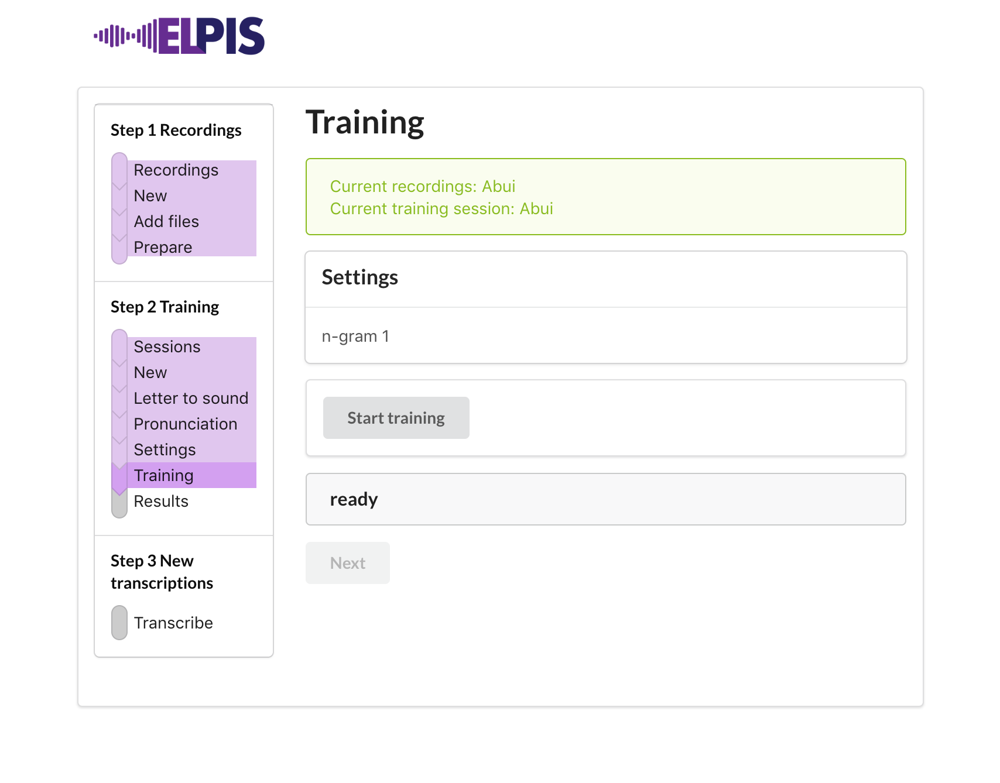
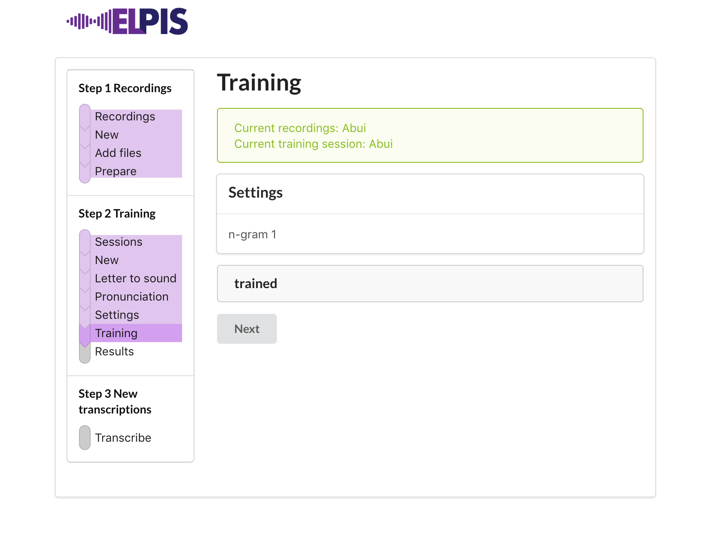
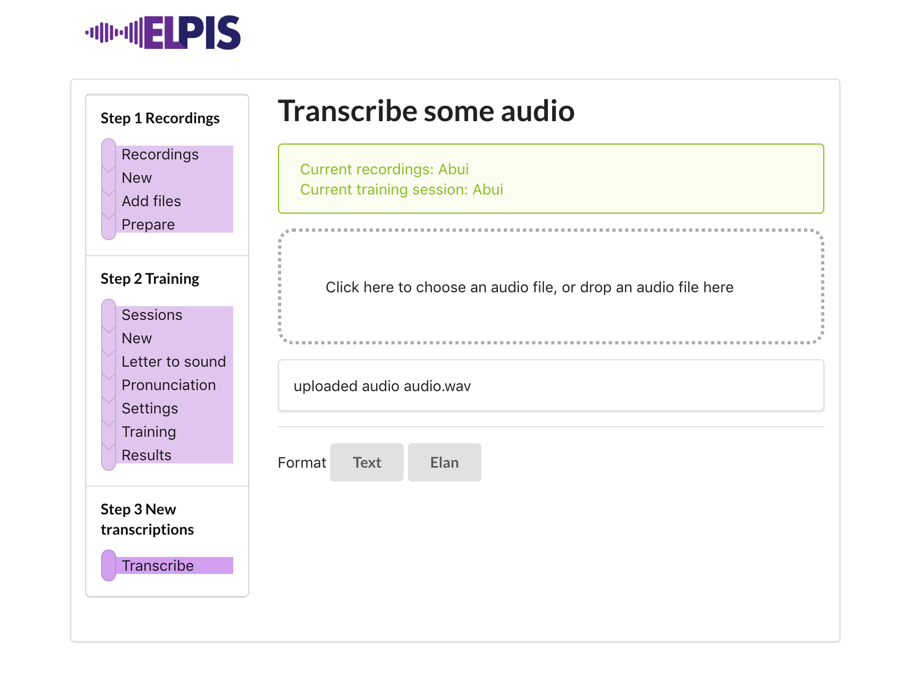

# Overview

The speech recognition (also called Speech to Text) process broadly involves steps of:

- Making pronunciation rules for your language
- Organising files that will be used to train the system
- Acoustic, pronunciation and language training

Then, using the trained system we can get a new transcription on un-transcribed recordings.


---


- [Setup](#setup)
  * [Get some training files](#get-some-training-files)
  * [Start Elpis](#start-elpis)
- [Recordings](#recordings)
  * [Add files](#add-files)
  * [Prepare](#prepare)
- [Training sessions](#training-sessions)
  * [Letter to sound rules](#letter-to-sound-rules)
  * [Pronunciation](#pronunciation)
  * [Settings](#settings)
  * [Training](#training)
  * [Results](#results)
- [Making a new transcription](#making-a-new-transcription)
- [More information about training files](#more-information-about-training-files)


---


# Setup

## Get some training files

Start with downloading some files to use during the workshop. [Download the Abui files here.](https://elpis.net.au/abui.zip)

## Start Elpis

- Get an address from the workshop spreadsheet [click here](https://bit.ly/2HfDNua).
- Open a new web browser (Chrome or Firefox).
- Paste the address into the location bar.
- Press Enter/Return to start Elpis.
- When Elpis starts it looks like this.




---


# Recordings

On the Elpis welcome page, click on *making a new group of recordings* to go to the *New group of recordings* page.



There are three main steps in Elpis, with sub-steps in each.

1. Recordings
2. Training
3. New transcriptions

**Recordings** is where we collect and prepare the audio and text which we will train the tool with.

**Training** is where “letter to sound” rules are applied to the training files to build a pronunciation dictionary, and then the acoustic and language parts of the system are trained.

**New transcriptions** is the place we go to use an existing training session to obtain a first-pass transcription on new audio.


Give your new bundle of recordings a name, then click Next.


## Add files

On the *Add files* page, click inside the dotted area and go to where you downloaded the Abui files. Open the training folder, select all the *wav* and *eaf* files and add them.



Click Next


## Prepare

On the *Prepare* page we can see how Elpis has read your training transcription files.



Click Next


---


# Training sessions

Now our training files have been prepared, we can start a new training session. Give it a name then click Next.


## Letter to sound rules

Upload the letter to sound rules from the Abui files folder. Elpis will use this to build a pronunciation dictionary for the training transcriptions.



The **letter to sound** file is a text file of rules mapping your orthography into phonemic transcription. It will be used to build a pronunciation dictionary for your training files.

It is formatted in two columns, space separated. Left column is all the characters in your corpus. The right column is a symbol representing the sound. You can use IPA or SAMPA for the right column. Comments can be written in the file with a # starting the comment line. For example,

```
# Abui
j J
f f
s s
h h
m m
n n
ng ŋ
r r
```

Click Next


## Pronunciation

On the Pronunciation dictionary page we can see how Elpis has used the letter to sound rules to work out how to pronounce the words in our training transcriptions. You may need to correct some of them! We are working on how to do this.



> The `!SIL` and `<unk>` lines are used to handle silence and unknown words.
>
> Check words that have been transcribed with consecutive matching characters. Do they represent one sound or two? If only one, add a line to your `letter-to-sound.txt` file, mapping the consecutive characters to a single symbol and rebuild the lexicon.
>
> For example, if `wu̱nne̱` is mapped to `wu̱nne̱ w ɨ n n ɛ` in the lexicon, then add `nn n` to `letter-to-sound.txt`, upload it again and rebuild the lexicon.  The results should be collapsed lexicon entry `wu̱nne̱ w ɨ n ɛ`.
>
> If your language has digraphs, put these earlier in the l2s, above single characters. For example,
>
> ```
> ng ŋ
> n n
> ```


## Settings


Here you can adjust settings which affect the tool's performance. A unigram (1) value will train the model on each word. A trigram (3) value with train the model by words with their neighbours.




## Training

Got to the **Training** page to kick off the training process. Press *Start training* to begin.




When it has finished, we should see **trained** in the middle of the page.




## Results

When training is done, go to the Results page to see the results for this training session. These results tell us how the training went, and help us to understand what happened in the training process. These numbers are **scored** by comparing the words in one of the original transcriptions against the computer's version.

The results are:

- WER - Word Error Rate
- a word count
- INS - words that have been inserted (added)
- DEL - words that were deleted (missed)
- SUB - words that have been substituted (mistaken)


----


# Making a new transcription

Now the training has been done, on the **New Transcriptions** step, we can **Choose a file**. Then decide whether you want the transcription in text format or an Elan file with the words aligned. When you click a format button, the transcribing starts. The process can take time, depending on how long your audio is.

> We are working on being able to handle long audio better. For now, just use a single utterance. Stay tuned for updates on this feature.





If you selected Text format, after the transcription is done, the transcription will show on the page. For either format, the text or Elan file can be downloaded.


Listen in Elan.
> If you are using your own audio, rename the audio to `audio.wav`.


---


# More information about training files

The system trains with existing audio recordings and transcriptions. Generally, the more hours of training recordings you can train with, the better the results. However, it’s not simply a matter of throwing everything you have into a bucket. Time spent cleaning and fine-tuning your existing transcriptions will have a good impact on your results.

You will typically get better results with few hours of files by using recordings from a common recording activity, e.g. short sentences, or stories, or word-repetition exercises.

For Elpis, the file format requirements are:

a) WAV audio, preferably 44.1kHz mono but the system can convert stereo files and resample from different sample rates.

b) Orthographic transcription of the audio. For today’s workshop, the interface is using Elan transcriptions, soon we will be able to use text files.

> We have other tools that will convert TextGrid and Transcriber files and will integrate this in the near future. Please let us know about your own file formats so we can include them in future versions!

c) Filenames of the transcription must match the audio filename.

> We are working on different ways to deal with this but for now, these are best done manually.

Transcriptions don’t need to be word level. Annotations at an utterance/phrase level are fine.

Clean your transcriptions by looking through them and checking the following:

- Standardise variation in spelling
* Replace non-lexical number forms, shorthand forms and abbreviations with full lexical forms. For example, replace ‘9’ with ‘nine’.
- For more cleaning tips, see the [Data preparation](https://github.com/CoEDL/elpis/wiki/Data-preparation) wiki page.


You can also add text files that contain words in the language, that don't have matching audio. These will be used to improve the system's language model.
