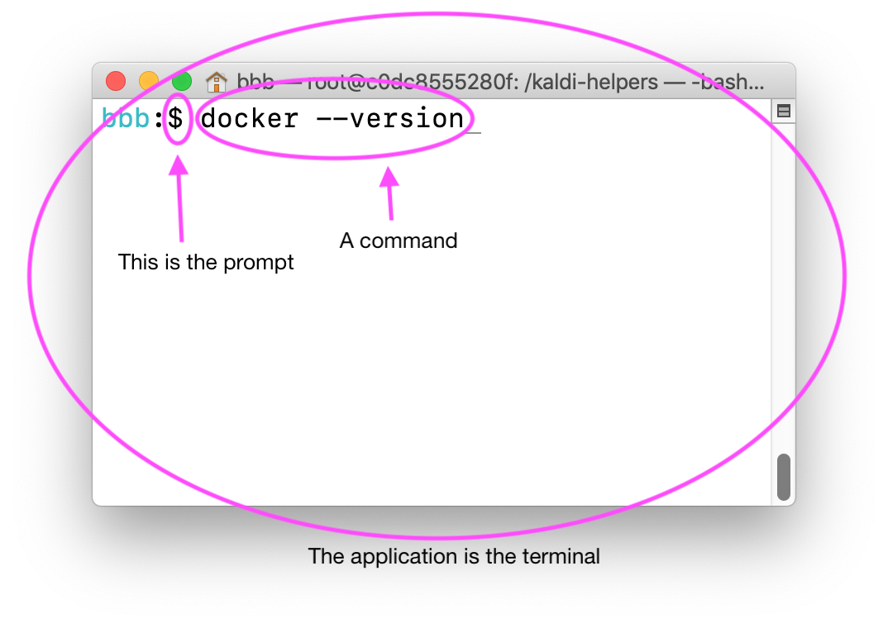
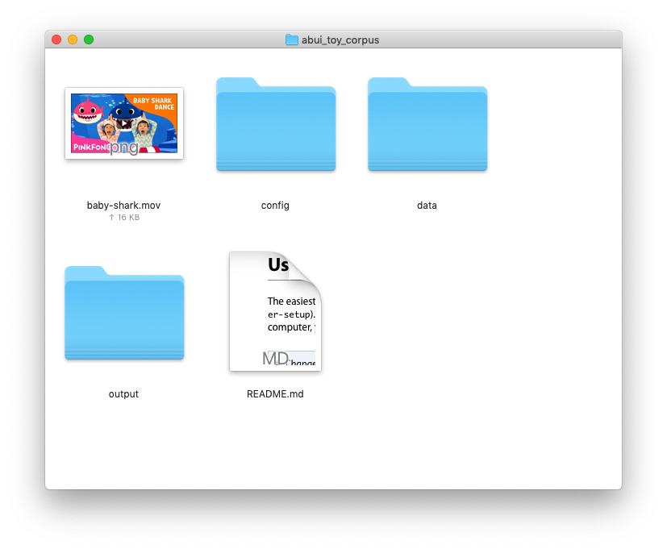
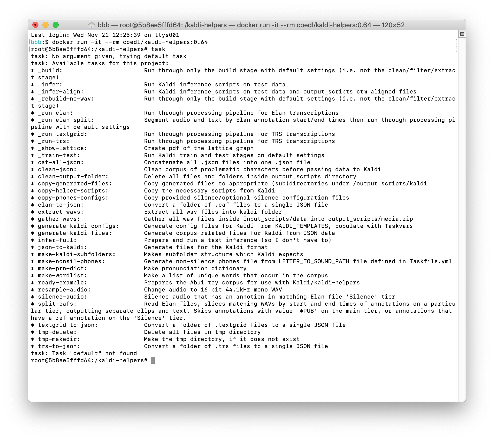

# 2018 CoEDL Summer School Elpis workshop steps 

This workshop covers the steps required to install and use an automatic speech recognition system, to obtain a transcription for an untranscribed audio file. 

We will use *Elpis*, a collection of small tools which will help us to prepare our language data in the format required to use a speech recognition tool called *Kaldi*. Elpis is a wrapper, or interface, to Kaldi.

Please refer to the *Glossary* for more information about particular terms used in the workshop, and let us know if there are other terms which need to be explained. The link to the Glossary is in the Slack channel.

**EEEEK… What to do if you run into a problem?**
First, check the *Questions* document (refer to Slack for the link). As we find answers to common problems, we will add information to this doc. If your problem is not described, please add it and let us know. 

Prepare for the workshop by

- Getting online
- [Installing Docker](2018-summer-workshop-preparation#install-docker-on-your-computer)
- [Downloading the coedl/kaldi-helpers docker image](2018-summer-workshop-preparation#download-the-workshop-code)
- [Downloading a toy corpus](2018-summer-workshop-preparation#download-some-toy-data)


Contents of this document

- [The tools](#the-tools)
- [Exercise 1 Getting familiar with Docker](#exercise-1-getting-familiar-with-docker)
- [Exercise 2 Sharing data with a Docker container](#exercise-2-sharing-data-with-a-docker-container)
- [Exercise 3 Demo with toy data in a container with Kaldi installed](#exercise-3-demo-with-toy-data-in-a-container-with-kaldi-installed)
- [Exercise 4 Deconstructing the demo](#exercise-4-deconstructing-the-demo)
- [Exercise 5 Using your own Elan data with the Kaldi container](#exercise-5-using-your-own-elan-data-with-the-kaldi-container)
- [Using data formats other than Elan](#using-data-formats-other-than-elan)
- [Cleaning up](#cleaning-up)
- [Further reading](#further-reading)


## The tools

**Docker** is a program which helps standardise the way we do computational tasks with data, regardless of the operating systems of all the people who might want to run those tasks. Rather than building separate code for Windows, Linux, Mac operating systems, we can write once and run it on a myriad of operating systems using Docker. For more information about Docker, view [Nay San's slides](http://goo.gl/qxQDPP).

After you have installed Docker, start it. On a Mac, you will see a little whale icon in the top menu bar. On Windows you'll see a whale icon in the system tray.

For the rest of the workshop, we will be using a **terminal** to interact with Docker and Elpis by typing instructions, or **commands** at the **command prompt**. 

 > A terminal is a program you need to use in order to control Docker. Docker itself will run on your computer and you communicate with it via simple, one-line text commands entered within your terminal application. When you use an application like Elan or Word, you are using a 'graphical user interface (GUI)' to do stuff to your data via menus and buttons. Another way of doing stuff with your data is by running software scripts that don't have a GUI, via a terminal, also known as a command line or command prompt.

 > A command is an instruction that tells a program to do something. 

 > On Mac, the prompt is `$` and Windows it is `>`. You'll see in this guide that the commands we write are prefixed by the prompt. You don't need to type the `$` or `>` when you use the commands, just type what follows. Also, press Return (or Enter) after typing the command.


On Mac, open the *Terminal* app in your *Applications > Utilities* folder. 

For Windows, open the search field in your taskbar, type  `command` or `cmd` into it. Then, click or tap on the *Command Prompt* result to open it.

Let's write a command to check that Docker is installed. Open your terminal, and type the following command at the prompt. Remember, you don't need to type the prompt character.

```
$ docker --version
```



In this command, `docker` is the name of the program we want to use, `—version` is an option (also known as an argument, flag or switch). When we work with command line programs, we don't have buttons or menus to interact with the program, so we use options to control what the program does. 

After running that command, we should see some version information. Hooray! Docker is set up OK. Now let's start working with **Docker images** and **containers**.

 > Think of a Docker image as a being like a zip file with stuff inside. In our case, the stuff will be an operating system, some code, some data. The image makes it easy to share this stuff around and use on a myriad of computers.
 > Containers are the 'unpacked' version of an image.


## Exercise 1 Getting familiar with Docker

Let's get a taste of using Docker images and containers by playing with a very simple one first. 

This exercise runs a Docker image (making a container) and writes some text to the screen. It automatically closes when it is done. 

In your terminal, type this command.

```
$ docker run hello-world
```
  
The first time you run this command, Docker will look for a local, previously downloaded version of the “hello-world” image. If you haven't done this exercise before, you should see a message that Docker was “Unable to find image 'hello-world:latest' locally”. After a seemingly endless pause, it will then attempt to download the image from the Docker Hub.

All going well, it will run, and you should get some words in your terminal like this.

    Hello from Docker!
    This message shows that your installation appears to be working correctly.

    To generate this message, Docker took the following steps:
     1. The Docker client contacted the Docker daemon.
     2. The Docker daemon pulled the "hello-world" image from the Docker Hub. (amd64)
     3. The Docker daemon created a new container from that image which runs the executable that produces the output you are currently reading.
     4. The Docker daemon streamed that output to the Docker client, which sent it to your terminal.

What does that all that mean?

If you see "*Hello from Docker! This message shows that your installation appears to be working correctly*." it is a sign that all is working well. Let's unpack the messages of what has happened.  

1.1. *The Docker client contacted the Docker daemon*
    The client is the program that you ran when you typed 'docker' at the prompt. The daemon is the software that runs in the background, accessible by the whale icon in the top menubar on Mac, or by the whale icon in the Windows system tray.  

1.2. *The Docker daemon pulled the "hello-world" image from the Docker Hub*
    This means that an image was downloaded from the Docker cloud server to your computer. You can check which images you have by typing `docker images` at the command prompt, and it will show a list in the terminal of the images that are available.  

1.3. *The Docker daemon created a new container from that image which runs the executable that produces the output you are currently reading*
    Docker unpacked the image and made a container. Then it ran a little program that output some text.  

1.4. *The Docker daemon streamed that output to the Docker client, which sent it to your terminal*
    In other words, the text ended up showing on your screen.


Well, that’s all this exercise does :relieved:.  Once it has output the information to the screen, Docker will automatically exit, closing the container.


## Exercise 2 Sharing data with a Docker container

To work with our own data in a container, we share a folder containing our data with the container. In Docker language, this is referred to as working with a *volume*. Volumes are a way to persist the data that a container works with and creates. The volume remains after you close a container.

 > For Windows, you will need to enable permissions for sharing your drive. Go to the taskbar, and right-click on the docker icon (the whale icon). Select Settings. Select Shared Drives. Then click on the check-box of the drive you want to share (C drive for most users). Your windows log-in password will be requested for you to authorize the sharing process. Input your password and then click apply.

2.1. Follow the steps in the [Download some toy data](2018-summer-workshop-preparation#download-some-toy-data) notes to get the Abui toy corpus if you don't already have it. Put the *abui_toy_corpus* folder from inside the downloaded folder on your *Desktop*.


2.2. The next command extends what we have used so far, adding a new option `-v` with a value, being the path to the local data joined to a name by which we will be able to access the folder inside the container. This will create a new container based on the alpine image, and share our data directory with the container.

#### Mac/Linux
```
$ docker run -it -v ~/Desktop/abui_toy_corpus:/docs-inside-docker alpine
```

#### Windows
Replace `your_username` with your Windows username.
```
> docker run -it -v "C:\Users\your_username\Desktop\abui_toy_corpus":/docs-inside-docker alpine
```

 > If you get an error that the "image operating system linux cannot be used on this platform", change Docker to use Linux mode by clicking the whale icon in the system tray and choosing *Switch to Linux containers* from the menu. [See the Docker info page for more info](https://docs.docker.com/docker-for-windows/#switch-between-windows-and-linux-containers).

What's it all mean?

`docker run` tells docker to create an instance of an image, creating a container.

`-it` is an *option*, which tells Docker to allow us to interact with the container that is created.

`-v` is another *option*, which tells docker that we want to share a volume.

`some/path:/docs-inside-docker` are *parameters* for the `v` *option*. The information before the colon is the path to your local data (also known as the source). The information after the colon is where it ends up in the container (also known as the target).

`alpine` is the name of the image we are running.

You may need to copy and paste the command as the backtick things around `pwd` may not be on your particular keyboard! They aren't on the German keyboard for instance. Remember that you don't need to copy the `$`, just what follows it.

2.3. After you type (or paste) that command into terminal, and press return, you should see something like:

    Unable to find image 'alpine:latest' locally
    latest: Pulling from library/alpine
    4fe2ade4980c: Pull complete 
    Digest: sha256:621c2f39f8133acb8e64023a94dbdf0d5ca81896102b9e57c0dc184cadaf5528
    Status: Downloaded newer image for alpine:latest
    / # 

This tells us that the alpine image is being downloaded, and eventually we end up with a different command prompt `/ # `, INSIDE the container.

If you have done this exercise before, it should go stright into the prompt, skipping the pull step.

2.4. We can verify that our local data has been shared with the container with this command. Type the following command, you don't need to type the `/ #` bit because that is a command prompt, just like `$` or `>`.

```
/ # ls docs-inside-docker
```

This will list the files in the container's *docs-inside-docker* folder. They should be the names of the files and folders that you see in your *Finder* or *Windows Explorer* when looking in the abui_toy_corpus folder. 

```
README.md    config    data    output
```

Try moving a file into the folder using Finder or Windows Explorer. Here, I've added a really funny music video file.



And then do `ls docs-inside-docker` again... 

```
README.md    baby-shark.mov    config    data    output
```

:smirk: 

Type `exit` at the command prompt to close the container.

```
/ # exit
```


## Exercise 3 Demo with toy data in a container with Kaldi installed

This exercise will share our toy corpus with a container, and run a demo task to prepare our data into the right format, train an ASR system, and get a hypothesis for new data.

Refer to the workshop preparation guide for how to [download the kaldi-helpers image](2018-summer-workshop-preparation#download-the-workshop-code) if you don't already have it. 

You'll also need to download the toy corpus and put the abui_toy_corpus folder on your Desktop if you haven't done that.

3.1. Use the following command to load the abui_toy_corpus directory into a new Docker container. We also introduce a new option `--rm` which cleans up when we exit the container.

#### Mac/Linux
```
$ docker run -it --rm -v ~/Desktop/abui_toy_corpus:/kaldi-helpers/working_dir/input coedl/kaldi-helpers:0.80
```

#### Windows

Replace `your_username` with your Windows username.
```
> docker run -it --rm -v "C:\Users\your_username\Desktop\abui_toy_corpus":/kaldi-helpers/working_dir/input coedl/kaldi-helpers:0.80
```


3.2. Pulling apart what it means:

```
$ docker run -it --rm -v ~/Desktop/abui_toy_corpus:/kaldi-helpers/working_dir/input coedl/kaldi-helpers:0.80
```

- `$` this is the prompt, after which we type our commands. You'll see `>` on Windows
- `docker run` this creates a container from a docker image
- `-it` interactive mode (so that you can stay inside the container while working. Otherwise it will immediately EXIT the docker container after running this command)
- `--rm` clean up/fully close the container after it's done (when you exit it)
- `-v`  mount (kind of like sharing) a volume (essentially a folder or directory)
- `~/Desktop/abui_toy_corpus/` the source (location) of the folder on your computer that you want to use inside the container. This is the folder that has our config, data and output folders in it.
- `:` …will be shared into…
- `/kaldi-helpers/working_dir/input` the target location, where we want the source folder to be within the docker container.
- `coedl/kaldi-helpers:0.XX` the name and version number (0.XX) of the docker image that you want to build a container from. 

Keep an eye on the image's version number. As we release fixes and new features this number will increment. To download new releases, change the version number when you do `docker run ..`. Docker is pretty clever and will just update the code that has changed.

3.3. Now the container is running, we can use a **task** to start the pipeline! Type:

```
    / # task _demo
```

This will race through the stages of 

- preparing the data into the formats that Kaldi requires
- training the models
- testing the models
- inferring a hypothesis for an audio file


Done? Don't close the container just yet, let's do that again a little slower, to understand more about the stages.


## Exercise 4 Deconstructing the demo

In this exercise, we will use the same data and the same container. Rather than using the demo task, we will use individual processing tasks. If you happen to have closed your container/terminal window, do step 3.1 again to create a new one.

4.1. Now we have the data shared with a container that has our pipeline scripts and Kaldi toolkit, we can build and use an ASR system.

The first task helps with preparing the data that we give it, into the formats that Kaldi expects. This stage
 
- reads the annotations from the Elan files in our corpus, making a wordlist and a json data file
- generates the lexicon from the wordlist and letter to sound map
- moves the files that Kaldi needs into the places that Kaldi expects

```
    / # task _run-elan
```

4.2. When this task has completed, you should see a 'Build task completed without errors' message. At this point, Kaldi has been set up with files in the right places for it to begin learning, ready to run the train-test task to build the ASR models.

```
    / # task _train-test
```

(For more gory details about what happens in this stage, please refer to Daan's slides.)

4.3. After building the models, this task will **score** them using a test data set. When this has completed you will see a list of score values. Interpret these results! Lower % is better.

    %WER 83.33 [ 5 / 6, 1 ins, 2 del, 2 sub ]

- **ins** = words inserted that were not in the original
- **del** = words deleted from the original
- **sub** = words that were incorrectly substituted for the original

Here's an example, courtesy of Zara Maxwell-Smith.

| type      | results                                                                                     |
|-----------|---------------------------------------------------------------------------------------------|
| Human     | **siapa** yang mau **menterjemahkan** direktur **pendidikan** **dasar** dan **menengah**    |
| Ind 3gram | **siapa** em em en terjemahkan di ketua **pendidikan** **dasar** ada **menengah** xx        |
| Bi 3gram  | xx **siapa** umm all **menterjemahkan** di there tua **pendidikan** **dasar** the mana ngeh |
| Bi 1gram  | xx siap ah mau **menterjemahkan** did add tua **pendidikan** **dasar** the **menengah**     |


4.4. Now we have trained models, we can use them to decode (or infer) a trancription for untranscribed audio. Prepare for this by making a folder, named *infer*, in your input directory (next to the *config*, *data* and *output* folders). Put an untranscribed audio file in there. 

 > For this toy corpus exercise, just copy one of the audio files from the data folder into the infer folder. 

```
├── abui_toy_corpus
│   ├── config
│   │   ├── letter_to_sound.txt
│   |   ├── silence_phones.txt
│   |   └── optional_silence.txt
│   ├── data
│   |   ├── 1_1_1.eaf
│   |   ├── 1_1_1.wav
│   |   ├── 1_1_2.eaf
│   |   ├── 1_1_2.wav
│   |   ├── 1_1_3.eaf
│   |   ├── 1_1_3.wav
│   |   ├── 1_1_4.eaf
│   |   ├── 1_1_4.wav
│   |   ├── 1_1_5.eaf
│   |   └── 1_1_5.wav
│   ├── infer
│   │   └── audio.wav
│   └── output
│       ├── kaldi
│       └── tmp
:
```


4.4.1. Run this task to generate the files we need for the system to be able to process a new audio file, and do the decoding.

    / # task _transcribe


Your *infer* folder should end up with a few more files...

```
├── abui_toy_corpus
│   :   
│   ├── infer
│   │   ├── audio.wav
│   │   ├── segments
│   │   ├── spk2utt
│   │   ├── utt2spk
│   │   └── wav.scp
│   :
:
```


The files are in this format:

    segments 
    <utterance_id> <recording_id> <start_time_milliseconds> <stop_time_milliseconds>

    spk2utt
    <speaker_id> <utterance_id>

    utt2spk
    <utterance_id> <speaker_id>

    wav.scp  
    <recording_id> data/infer/audio.wav


4.4.2. After decoding, you'll see the results in the terminal, and a file containing the hypothesis will be copied back into the infer folder. The format of the results is `<utterance_id> <confidence> <start_ms> <duration> <word>`.

```
3a2a6f18-5822-4d0d-b6cc-89f47b47b097-1f03785c-b6f3-4cf4-b660-3c50312f081b 1 0.000 0.310 mai 
3a2a6f18-5822-4d0d-b6cc-89f47b47b097-1f03785c-b6f3-4cf4-b660-3c50312f081b 1 0.310 0.160 kaai 
3a2a6f18-5822-4d0d-b6cc-89f47b47b097-1f03785c-b6f3-4cf4-b660-3c50312f081b 1 0.470 0.220 deina 
3a2a6f18-5822-4d0d-b6cc-89f47b47b097-1f03785c-b6f3-4cf4-b660-3c50312f081b 1 0.690 0.350 dapakdi 
3a2a6f18-5822-4d0d-b6cc-89f47b47b097-1f03785c-b6f3-4cf4-b660-3c50312f081b 1 1.040 0.130 lung 
3a2a6f18-5822-4d0d-b6cc-89f47b47b097-1f03785c-b6f3-4cf4-b660-3c50312f081b 1 1.170 0.160 lung 
3a2a6f18-5822-4d0d-b6cc-89f47b47b097-1f03785c-b6f3-4cf4-b660-3c50312f081b 1 1.330 0.120 ya 
```


4.4.3. To get a time-aligned inference, clear out the files in the infer folder (leave the audio file) and run this task.

    / # task _transcribe-align

When this completes, an Elan file should be copied back to your infer folder. You can open it to check.. 
 
 > If you are using a toy corpus, please don't expect that the results are even close to correct! There isn't enough data in a toy corpus to train a useful model.


4.5. Exit the container to close it.

```
    / # exit
```


## Exercise 5 Using your own Elan data with the Kaldi container

This exercise shows how to set up the initial folders with your own data. The commands are just like what we did in exercise 4. 

5.1. Clean your data. [Read more about that here](cleaning-data).

5.2. Set up your folders

- On the Desktop, create a new folder, name it *elpis_workshop*. 

- Inside it, make three folders: named *config*, *data* and *output*.

```
├── elpis_workshop
│       ├── config
│       ├── data
│       └── output
:
```


5.3. Add the config files. You can reuse the the silence files, but you have to create the letter to sound file to suit your language data.

- Copy the *optional_silence.txt* and *silence_phones.txt* files from the Abui toy corpus config folder into your *config* folder.
- In your *config* folder we also need to create a text file which has a letter to sound map...


5.4. Add your data. 

Put the audio and transcription files you have for training into the *data* folder. Elpis can handle Elan .eaf files, Transcriber .trs files and Praat .TextGrid files. 

Please use 16bit 44.1kHz mono WAV files.


5.5. Start up a new Docker container, sharing your data. 

#### Mac/Linux
```
    $ docker run -it --rm -v ~/Desktop/elpis_workshop:/kaldi-helpers/working_dir/input coedl/kaldi-helpers:0.80
```

#### Windows

Replace `your_username` with your Windows username.
```
    > docker run -it --rm -v "C:\Users\your_username\Desktop\elpis_workshop":/kaldi-helpers/working_dir/input coedl/kaldi-helpers:0.80
```


5.6. Now you can use the tasks to process your data, and build the models. If your data is in Elan format, and is clean, you can use the default tasks. These tasks will build the project, train and test on your own data, using transcriptions from tiers named 'Phrase'.

If you are using the abui-trs data, the training data was transcribed using a program called Transcribed, not Elan, so we need to use a different task.. instead of _run-elan use _run-trs.

```
    / # task _run-elan
```

(or)

```
    / # task _run-trs
```


Wait till that is done...


```
    / # task _train-test
```

Wait some more...


5.7. Once the models have been trained, you can get a hypothesis for untranscribed audio.


5.7.1. Prepare the files. Kaldi works best with short audio clips, utterances about 10 seconds long. We are planning to improve support for longer audio over summer - stay tuned! For now, please use a single audio file, max 10 seconds duration.

Audio specifications:

- WAV file
- 16bit
- 44.1kHz
- mono (single channel)

Make a folder, named *infer*, in your input directory (next to the *config*, *data* and *output* folders). Put an untranscribed audio file in there.

5.7.2. As before, run the `_transcribe` or `_transcribe-align` tasks. The helper files will be created, and after decoding, the results will be copied back into the infer folder. 

    / # task _transcribe-align


5.7.3. Review the results

...hmmm

---

## Using data formats other than Elan
To work with Praat Textgrid files, Transcriber trs files, or if you need to resample your data, use one of the [recipes](recipes) according to the particular type and condition of your data.

For information about the pipeline data processing options, run the `task` command inside the Docker image to show a list of helper tasks available, or read more about the [tasks here](tasks).

<!--
task: Available tasks for this project:
* _build:           Run through only the build stage with default settings (i.e. not the clean/filter/extract stage)
* _infer:           Run Kaldi inference_scripts on test data
* _infer-align:         Run Kaldi inference_scripts on test data and output_scripts ctm aligned files
* _rebuild-no-wav:      Run through only the build stage with default settings (i.e. not the clean/filter/extract stage)
* _run-elan:            Run through processing pipeline for Elan transcriptions
* _run-elan-split:      Segment audio and text by Elan annotation start/end times then run through processing pipeline with default settings
* _run-textgrid:        Run through processing pipeline for TRS transcriptions
* _run-trs:             Run through processing pipeline for TRS transcriptions
* _show-lattice:        Create pdf of the lattice graph
* _train-test:          Run Kaldi train and test stages on default settings
* cat-all-json:         Concatenate all .json files into one .json file
* clean-json:           Clean corpus of problematic characters before passing data to Kaldi
* clean-output-folder:      Delete all files and folders inside output_scripts directory
* copy-generated-files:     Copy generated files to appropriate (sub)directories under /output_scripts/kaldi
* copy-helper-scripts:      Copy the necessary scripts from Kaldi
* copy-phones-configs:      Copy provided silence/optional silence configuration files
* elan-to-json:         Convert a folder of .eaf files to a single JSON file
* extract-wavs:         Extract all wav files into kaldi folder
* gather-wavs:          Gather all wav files inside input_scripts/data into output_scripts/media.zip
* generate-kaldi-configs:   Generate config files for Kaldi from KALDI_TEMPLATES, populate with Taskvars
* generate-kaldi-files:     Generate corpus-related files for Kaldi from JSON data
* infer-full:           Prepare and run a test inference (so I don't have to)
* json-to-kaldi:        Generate files for the Kaldi format
* make-kaldi-subfolders:    Makes subfolder structure which Kaldi expects
* make-nonsil-phones:       Generate non-silence phones file from LETTER_TO_SOUND_PATH file defined in Taskfile.yml
* make-prn-dict:        Make pronunciation dictionary
* make-wordlist:        Make a list of unique words that occur in the corpus
* ready-example:        Prepares the Abui toy corpus for use with Kaldi/kaldi-helpers
* resample-audio:       Change audio to 16 bit 44.1kHz mono WAV
* silence-audio:        Silence audio that has an annotion in matching Elan file 'Silence' tier
* split-eafs:           Read Elan files, slices matching WAVs by start and end times of annotations on a particular tier, outputting separate clips and text. Skips annotations with value '*PUB' on the main tier, or annotations that have a ref annotation on the 'Silence' tier.
* textgrid-to-json:         Convert a folder of .textgrid files to a single JSON file
* tmp-delete:           Delete all files in tmp directory
* tmp-makedir:          Make the tmp directory, if it does not exist
* trs-to-json:          Convert a folder of .trs files to a single JSON file
-->


## Cleaning up

After the workshop, you can delete the docker image to free up space on your computer. Only do this if you aren't using Docker for other work -- these commands will remove all containers and images.

Have a look at what containers may still be running with this command.

`$ docker container ls`

Prune (remove) the containers.

`$ docker container prune`

Next, time to prune images.

`$ docker image prune -a`

Check that images have been removed 

`$ docker images`


## Further reading

### Want to learn more about Kaldi?

From the official docs, this is a good place to start.

- [Kaldi for dummies tutorial](http://kaldi-asr.org/doc/kaldi_for_dummies.html)

These sites have good intros to Kaldi. Well explained, with guides and tutorials for getting started. Worth digging through, and Josh's installation guide is good to have while installing (if you aren't using the Docker image).

- [Eleanor Chodroff](https://eleanorchodroff.com/tutorial/kaldi/index.html)
- [Josh Meyer](http://jrmeyer.github.io/asr/2016/01/26/Installing-Kaldi.html)
- [Lyndon White](http://white.ucc.asn.au/Kaldi-Notes/resources)
- [A good Kaldi tutorial](https://groups.google.com/forum/#!topic/kaldi-help/tzyCwt7zgMQ)

Looking for particular features? 

- [Check the forums](https://groups.google.com/forum/#!forum/kaldi-help)
- [More info about Kaldi lattices](https://senarvi.github.io/kaldi-lattices/)
- [Kaldi lectures by Dan Povey](https://danielpovey.com/kaldi-lectures.html)

### Data

- [Unicode article](https://medium.com/@apiltamang/unicode-utf-8-and-ascii-encodings-made-easy-5bfbe3a1c45a)
- [Information about data standards, text encoding etc](https://www.sil.org/language-technology/standards)
- [voxforge open source data](https://www.voxforge.org)
- [openslr open source data](https://www.openslr.org)

### ASR tools

- [CMU Sphinx](https://cmusphinx.github.io/wiki/tutorial/)
- [Persephone](https://persephone-asr.org)

### Books

- *Natural Language Annotation for Machine Learning* by James Pustejovsky and Amber Stubbs  
- *Natural Language Processing with Python* by Steven Bird, Ewan Klein and Edward Loper  
- *Speech and Language Processing* by Daniel Jurafsky and James Martin  
- *Foundations of Statistical Natural Language Processing* by Christopher Manning and Hinrich Schuetze  
- *Text-to-Speech Synthesis* by Paul Taylor  
- *The HTK Book* by Steve Young et al