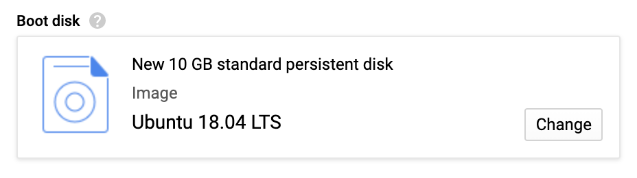
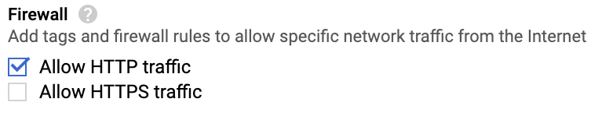
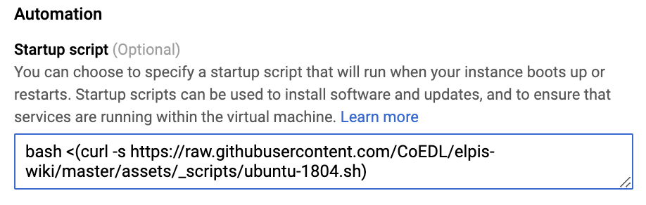
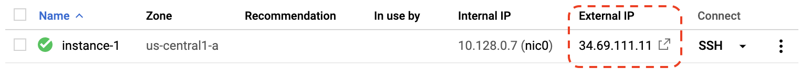
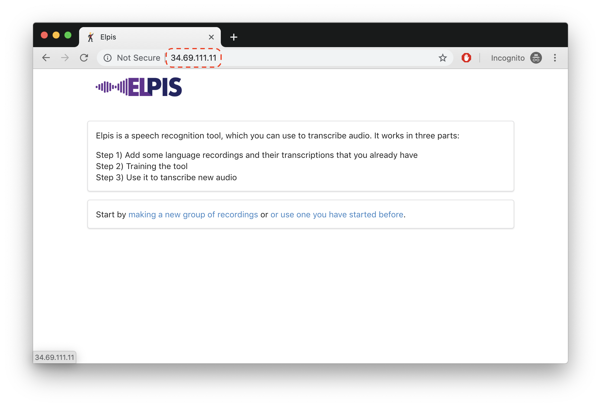
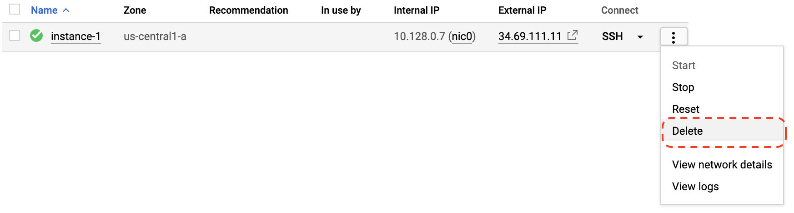

# Elpis setup using Google Cloud Platform

- Create an account on Google Cloud Platform or sign into your existing one.

- To create a new VM Instance (Compute Engine), go to [https://console.cloud.google.com/compute/instancesAdd](https://console.cloud.google.com/compute/instancesAdd)

- Under *Boot disk*, select the `Ubuntu 18.004 LTS` image:

	

- Under *Firewall*, check the `Allow HTTP traffic` option:

	

- Click on the `Management, security, networking, sole tenancy` to expand the section.

- In the `Startup script`, copy the following text and paste it into the text box provided by GCP:

	```
	bash <(curl -s https://raw.githubusercontent.com/CoEDL/elpis-wiki/master/assets/_scripts/ubuntu-1804.sh)
	```

	
	
- Click `Create`	

- After creating, GCP will launch the VM Instance and assign it an IP address (e.g. `34.69.111.11`):

	
	
- After a short while (around 5-10 minutes), the Elpis interface will be available at the IP address:

	
	
## Teardown	

- After you're finished with Elpis, remember to delete the instance by clicking on the dropdown on the right of the launched instance and then `Delete`.

	